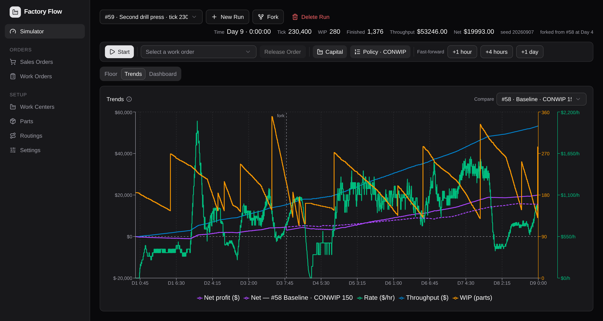
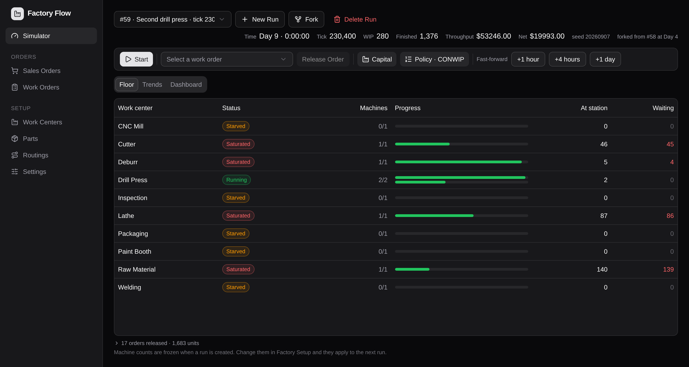
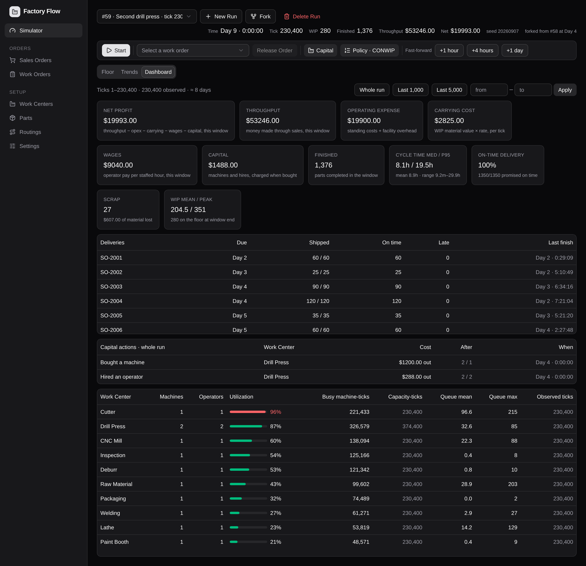
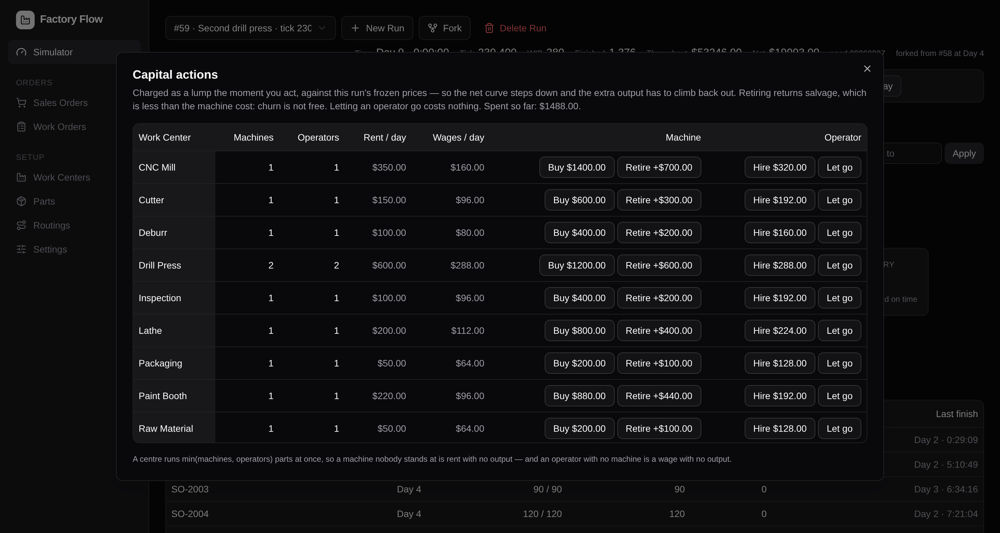
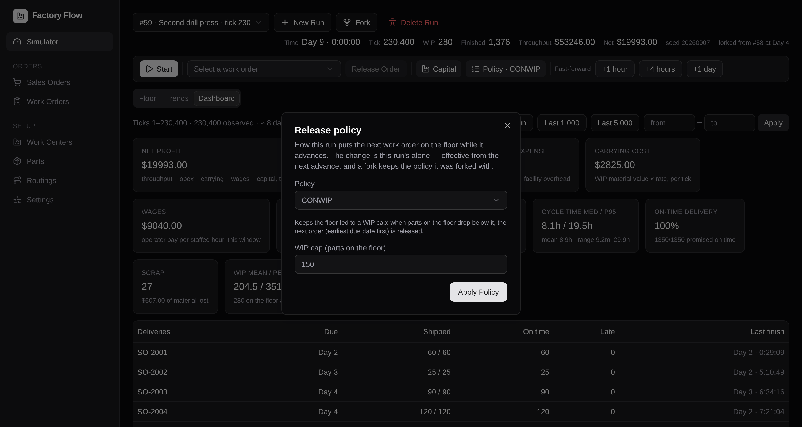
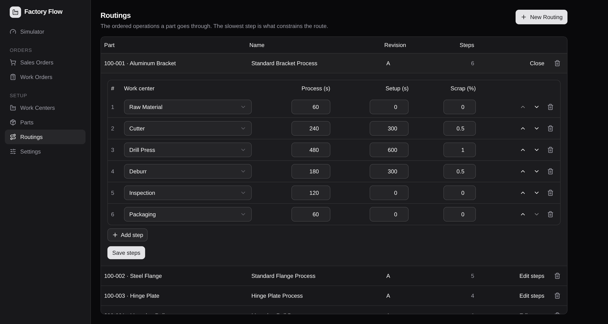
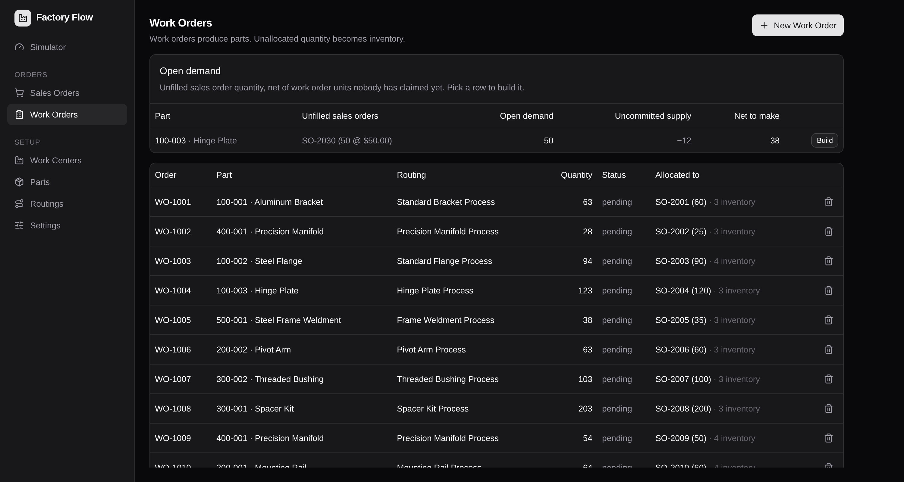

# 🏭 Factory Flow

[](https://github.com/seanmckee/Factory-Flow/actions/workflows/ci.yml)

**A manufacturing simulator where the score is net profit, not parts finished.**

Model a shop floor, run it forward through simulated days, fork the run at any
moment, take one decision in one branch — then measure what that decision was
worth.

It's a study of Eliyahu Goldratt's _The Goal_, built as software: throughput is
money made through sales, inventory is money tied up on the floor, and operating
expense is money burned turning one into the other. Optimising a machine is
easy. Optimising the system is the whole problem, and it's only visible once
running a machine costs money whether or not it produces anything.

**Stack** — React 19 · TypeScript · Vite · Tailwind v4 · Recharts ·
Express 5 · Drizzle ORM · Neon serverless Postgres · Zod · Vitest ·
Python 3.12 · FastAPI · LangGraph · LangSmith

**Status** — the simulator is complete and driveable end to end, and an AI
analyst reads it over the same REST API the browser uses: 346 unit tests, none
of which touch a database, an HTTP server or a live model.

---

## The question it exists to answer

The drill press is the constraint. A second one costs $1,200, plus $288 to hire
somebody to stand at it, plus $300/day of rent and $144/day of wages forever
after. Is it worth it?

You can't answer that from a utilization chart. You answer it by running the
factory twice from the same moment, with the same dice, and reading the money.



Run **#58** kept one press. Run **#59** was forked from it at the start of day 4,
bought a second press and hired an operator, and ran on. Same seed, same order
book, same release policy — the branches are byte-identical up to the dashed
`fork` line and diverge only because of the decision.

By day 9:

|                  | #58 Baseline | #59 Second press |
| ---------------- | -----------: | ---------------: |
| Throughput       |  $45,162.00 |       $53,246.00 |
| Capital spent    |       $0.00 |        $1,488.00 |
| **Net profit**   | **$15,505.25** |   **$19,993.00** |
| Parts finished   |        1,010 |            1,376 |

The $1,488 decision was worth **$4,487.75** in five simulated days. That number
is the product — not the chart, not the utilization figure. Everything in the
codebase exists so that number can be trusted: same seed, same draws, frozen
prices, money summed from columns written when it was earned.

---

## The tour

### The floor — what is happening right now



One row per work centre, redrawn as the run advances. `Starved` / `Running` /
`Saturated` are the only three states a snapshot can honestly distinguish, so
they're the only three there are. The run bar above is the whole state of the
world: simulated day and time, tick, WIP on the floor, money in, net profit,
the seed, and — for a fork — where it branched from.

A run is a server-side object. Reload the page, come back tomorrow, open it in
two tabs: it's the same run at the same tick, because the browser holds no
simulation state at all.

### The dashboard — a P&L over any window



Net profit leads, because everything else is an input to it:

```
net = throughput − operating expense − carrying cost − wages − capital spend
```

Then the things that explain it: on-time delivery per sales order (which
promise broke, not just how many), cycle time as median and p95, scrap, WIP
mean and peak, and the work centres ranked by utilization with the constraint on
top.

Read that ranking against the fork above. Having bought the second press, the
drill press has dropped to 87% and **the Cutter is now the constraint at 96%** —
the bottleneck moved, which is exactly what Goldratt says happens and exactly
what makes the next decision a different decision.

Every figure is windowed, and the window is stated. The same work centre read
10% utilization over a whole run and 52% over the ticks it was actually working;
an unlabelled average is a lie with a number in it.

### Capital actions — decisions that cost money up front



Buying is a whole-factory question, so it gets the whole factory in one table:
what each centre has, what it costs per day, and what changing it costs now. A
centre runs `min(machines, operators)`, so a machine nobody staffs is rent with
no output and an operator with no machine is a wage with no output.

The prices are the run's **own frozen prices**. Edit the master data mid-run and
this run neither sees the new number nor is charged it — that's what makes two
forks comparable. Spend is charged as a lump at the tick it lands (a five-year
amortisation would be ~$11/day against a ~$3,300/day factory, i.e. free, i.e.
"always buy" wins and the decision stops being a decision).

### Release policies — how work reaches the floor



A run can feed its own floor as it advances: **CONWIP** (hold floor WIP under a
cap), **due-date** (release each order a lead time before its promise), or
**drum-buffer-rope** (pace releases to the constraint's queue). Priority is
earliest due date throughout. It's a per-run setting frozen at creation and
changeable any time under the run's lock, so two forks can play the same order
book under different release rules — the comparison the whole app is shaped
around.

Releasing everything on day one is always available, and always expensive:
material on the floor accrues a carrying charge per day, so "release less" has a
number attached to it.

### The factory is data



Parts, work centres, routings with ordered steps, work orders, sales orders with
due dates, and the allocations that link them. Besides its work centre, a
routing step carries three numbers that make it behave like an operation rather
than a delay: a nominal process time (sampled ±30% per unit), a changeover time
paid once per work order, and a scrap rate in basis points, drawn at step
completion — so the machine time is spent and _then_ the unit fails.



Demand and supply are separate objects joined by allocations, which is what
makes a finished unit worth money: a unit covered by an allocation earns
`unit price − material cost`, and a unit beyond the allocated quantity earns
nothing at all. Finish order therefore decides which sales order — and which
price — a unit is credited to.

---

## How it works

### The engine

`backend/src/simulation/` is pure functions: tick the floor, sample a process
time, accrue a rate, credit a finished part, aggregate a window. No database, no
HTTP, no `Date.now()`. That's why its 231 tests run in 150 milliseconds and why
the rules are the tests rather than the other way round.

- **One tick is one staffed second.** A calendar day is `shifts × 28,800` ticks.
  Off-shift time isn't simulated and isn't skipped-with-gaps — it simply isn't
  ticks, which is what makes a second shift double the day's wage bill while
  amortising the same rent.
- **Money is integer cents, everywhere.** Rates are accrued as an exact integer
  floor-difference of the tick number, so splitting a run into batches can't
  drift and a full day sums to exactly the daily rate. Carrying cost is the one
  true accumulator (it depends on what sat on the floor), and it keeps its
  remainder in the run row so the lifetime charge is exact however the run was
  chunked.
- **Nothing is derived after the fact that can be observed as it happens.** A
  machine that finished a part during a tick was busy for all of it and is empty
  by the time anything could look, so the tick emits its own metrics — busy
  machines, queue depth, and the effective capacity it admitted against.

### Determinism, and why it's load-bearing

Randomness is not drawn at call time. A process time is a pure function of
`(seed, workOrderId, unitIndex, stepIndex)`, hashed and avalanched, with scrap
drawn from a second independent domain over the same key. A run therefore
persists one integer — its seed — and no cursor. Re-create it, resume it, fork
it: every draw comes back identical.

This broke once, instructively. The draw key used to include the part's UUID,
which is minted fresh at every release — so two runs created with the same seed
drew different noise, and comparing them measured the dice instead of the
decision. `UNIQUE(run_id, work_order_id, unit_index)` is what makes the current
key name exactly one part.

### A run freezes the factory it was created with

Once a run exists, the engine reads that run's own copy of the config —
machines, operators, standing costs, wages, capital prices, facility rates,
shift width — and never the live tables again. Routing steps are pinned per
**work order** at release, so editing a routing changes only later releases and
never re-plans a part already halfway down a route.

That's what lets two runs disagree about the drill press, and it's what makes
forking a copy rather than a versioning scheme: `POST /api/runs/:id/fork` copies
every `run_*` table row-for-row under the parent's lock, in one transaction. A
replay-identity check (`npm run check:fork`) proves the branches stay
byte-identical until a decision separates them.

The frozen config has exactly two writers — a capital action, which charges the
run's own price and appends an append-only log row, and a policy change. Neither
touches the shared factory, and no read ever re-derives money from a rate: the
cents are frozen into the row when they're spent or earned, so a later edit
cannot rewrite what a finished run did.

### Persistence and the advance loop

`POST /api/runs/:id/advance {ticks}` loads the run once, ticks it in memory and
writes once per 3,600-tick batch — one transaction each, so a crash costs at
most one simulated hour and never leaves a half-written run. Advancing takes a
row-level `advancing` lock; a release, a capital action or a policy change
landing mid-batch would be overwritten by the write that follows it, so all four
contend for the same lock and a 409 is a real answer rather than a race. A stale
lock (a killed process) is clearable from the UI, worded as an assertion the
user is making rather than a retry.

Observations are stored per simulated minute on an absolute grid — every field a
sum, a count or a max, never a mean, so grouping is lossless and you divide once
at the end. WIP needs three fields, because a level isn't a flow: the mean's
numerator, the peak, and the closing value. That change alone took a whole-run
metrics read on a 15-day playthrough from 7.4s to 1.13s with every reported
figure byte-identical across the migration.

On this machine a loaded floor of 150–280 parts advances at **~8,000 ticks per
second**, so a simulated day takes about four seconds and the fast-forward in
the UI streams it in committed hourly chunks with the charts flying through it.

### The API

A run is driven entirely over HTTP, which is why the UI has no privileges an
agent won't have:

| Endpoint | |
| --- | --- |
| `POST /api/runs` | create a run, freezing the factory's rates, shifts and policy into it |
| `GET /api/runs/:id` | summary and whole-run P&L |
| `POST /api/runs/:id/releases` | put a work order on the floor, pinning its routing steps |
| `POST /api/runs/:id/policy` | change this run's release policy, effective next advance |
| `POST /api/runs/:id/actions` | buy/retire a machine, hire/let an operator go (`GET` lists the log) |
| `POST /api/runs/:id/advance` | tick it forward, ≤ 20,000 ticks per call |
| `POST /api/runs/:id/fork` | copy the run at its current tick into a new branch |
| `GET /api/runs/:id/floor` | snapshot: what's at each centre, how far along |
| `GET /api/runs/:id/metrics` | the P&L, utilization, cycle time, OTD and scrap over a tick window |
| `GET /api/runs/:id/ticks` | the observation series, server-side bucketed |

Plus REST CRUD for the factory definition itself — parts, work centres,
routings, work orders, sales orders, settings. Every body, param and query is
zod-validated, and every error response in the API is `{ message }`, which the
UI toasts verbatim.

An advance answers with more than a tick number: the surviving WIP count, what
scrapped, what the release policy put on the floor, and how many orders remain
releasable — so a caller running until the factory drains stops on the
advance's own answer rather than chasing it with a read that may already be
stale.

### Frontend

The frontend holds no simulation. It had its own copy of the engine once; the
two drifted, and the frontend's was deleted the day the page switched to driving
a server-side run. What's left in `frontend/src/simulation/` is pure display
transforms — cumulative curves, trailing rates, a fork-aware merge of two runs'
net series, tick-to-calendar formatting — each unit-tested like the engine.

A subtlety the cumulative chart forced: `/ticks` returns at most the newest
5,000 rows, so a long run's series is a **suffix**. Accumulating it from zero
would draw a curve that contradicts the money above it, so the opening balance
is derived exactly — the run's total minus the window's own sum, two sums over
the same frozen columns — and the curve carries on from where the run really
was.

---

## The agent

A third service — `agent/`, a Python FastAPI app hosting a LangGraph ReAct
agent — reads the simulation through the backend's REST API and nothing else.
Its entire tool surface is HTTP, so it inherits the run locks, the frozen
config and the seed reproducibility exactly as the browser does. There is no
back door into the engine, which is why the API was built first.

Phase 1 is a **read-only analyst**. Ask it *"which run made the most money and
where is its constraint?"* and it plans over eight GET tools — the run list, a
run's P&L, windowed metrics, the floor snapshot, the capital log, both sides of
the order book, the facility settings — and answers with figures it can cite.
The authority boundary is structural rather than an instruction it is trusted
to follow: the tool module holds no verb that changes anything. Answers stream
to the `/agent` page as server-sent events with the tool calls included, so you
watch what it looked at while it reads.

The tool docstrings are load-bearing, because they are what the model plans
with. They carry the domain semantics that a competent reader still gets wrong:
money is integer cents, throughput is money made through sales and never a
count of parts, `netCents` is the score and can be negative, and utilization
has to come from a window rather than from a snapshot.

### Evals scored against the sim, not against a judge

This is what the determinism buys. `uv run python -m factory_agent.evals.run`
builds a LangSmith dataset whose **ground truth is computed from the same
backend the agent reads** — argmax net over the run summaries, argmax
utilization over a run's metrics, the order-book totals — so a wrong answer is
a wrong answer rather than a disagreement with an LLM judge. The dataset is
rebuilt from live sim state on each invocation under one stable name, so
experiments accumulate against fresh truth.

The first suite scored **5/7**, and both failures were real defects rather than
scoring noise:

- The "buy me a machine" trap died on a raised exception when the model passed
  a bad argument, instead of the tool error returning to the model so it could
  refuse the way it was meant to.
- It named the constraint "work center 98" rather than "Drill Press": metrics
  carries ids only, and nothing told it to resolve names off the floor.

Both are cheap fixes. Finding them is the point — the same suite re-runs after.

Next in this track: write tools (release, policy, capital, advance, fork)
behind the same lock protocol the UI obeys, then the experiment graph — fork a
run, take a decision in the branch, advance both, read the delta in net profit.
The interesting part was never the tool-calling. It is that the environment can
already tell the agent whether it was right, and the whole simulator was built
to make that a measured answer rather than an assertion.

---

## Running it

Three independent projects, no monorepo tooling. Node 20.19+ (Vite 8), a
Postgres connection string (Neon, or anything the serverless driver can reach —
the WebSocket `Pool` is used rather than the HTTP driver because writes span
tables and need real transactions), and — for the agent — Python 3.12+ with
[uv](https://docs.astral.sh/uv/) and an OpenAI key. The simulator runs fine
without the third terminal; only the `/agent` page needs it.

```bash
# backend — port 3000, needs backend/.env with DATABASE_URL=postgres://…
cd backend
npm install
npx drizzle-kit migrate
npm run seed        # the playground factory: 10 centres, 10 parts, 29 orders
npm run dev

# frontend — port 5173
cd frontend
npm install
npm run dev

# agent — port 8000, needs agent/.env with OPENAI_API_KEY (see .env.example)
cd agent
uv sync
uv run uvicorn factory_agent.main:app --reload --port 8000
```

Then open the simulator, click **New Run**, pick a release policy, and
fast-forward a day.

```bash
npx vitest run          # backend 231 tests, frontend 96
uv run pytest           # agent 19 tests, no live model calls
npm run check:fork      # backend, live DB: a fork replays its parent exactly
npm run check:policy    # backend, live DB: policies stay isolated per run
```

The seed is tuned rather than arbitrary: ~$3,340/day of burn at one shift, a
constraint ladder (drill press → cutter → mill) that shifts as you buy capacity,
and margins per constraint-second that make the dispatch decision non-obvious.
A 15-day playthrough on it nets **+$42,444 at 100% on-time delivery** if you
expand early, and considerably less if you don't.

---

## Deliberately not built

Being explicit about scope, because half of these are decisions rather than
omissions:

- **No background clock.** Nothing advances a run unattended; a request drives
  it. A background loop would be the first stateful thing in the server process,
  and an agent driving a run wants determinism, not something ticking underneath
  it.
- **No speed multiplier.** The live clock plays one simulated minute per real
  second, and fast-forward jumps in calendar units. A "100×" button starts lying
  the moment it outruns what the server sustains.
- **No cash balance.** A run can't be refused a purchase for want of funds; net
  just goes further negative. Financing is a different game.
- **No late penalty, no scrap write-off.** Both are measured and frozen
  per-part — the due tick a unit was promised, the material a scrapped unit
  cost — so a money penalty is layerable later without rewriting history. Today
  lateness costs you the metric, and scrap costs you the wasted machine time,
  the carrying already paid and the sale that unit didn't make.
- **No event log.** There's a full time series (money, WIP, per-centre occupancy
  and queues per simulated minute) but not an append-only log of discrete
  events. That's the piece a root-cause explainer would need.
- **No BOMs, no multi-level assembly, no machine breakdown, no explicit
  queues.** Queue *depth* is measured; queue *order* isn't a thing you can
  reach in and change yet.
- **Overtime and non-uniform shift calendars.** Overtime's entire economic
  identity is its premium, and a mid-run shift change makes a run's calendar day
  non-uniform while `day_ticks` is currently one frozen integer. It's a
  day-boundary table's worth of work, not a flag.

---

## What's next

The agent's remaining phases, described above: write tools behind the run
lock, then the experiment graph that forks a run, takes a decision in one
branch and reads the delta.

Further out, in rough order of how much of it is grounded in something the
system can already cite:

- **An event log**, and root-cause reports over it: given an order that shipped
  late or a day that lost money, walk backwards and name the constraint, the
  queue, the decision.
- **Multi-run comparison** beyond one overlaid curve — every metric, same
  window, deltas highlighted, a P&L column per branch.
- **Lateness prediction** as a conventional ML problem (real labels, calibrated
  probabilities, features that already exist in the time series) rather than
  something an LLM guesses at.
- **Injected disruption** — breakdowns, absences, rush orders, cost shocks — to
  stress-test a schedule that looks fine when nothing goes wrong.

`PROGRESS.md` is the operational ledger — what shipped, what's next, and the
reasoning behind the sequencing. `CLAUDE.md` holds the design invariants that
the code is expected to keep.
